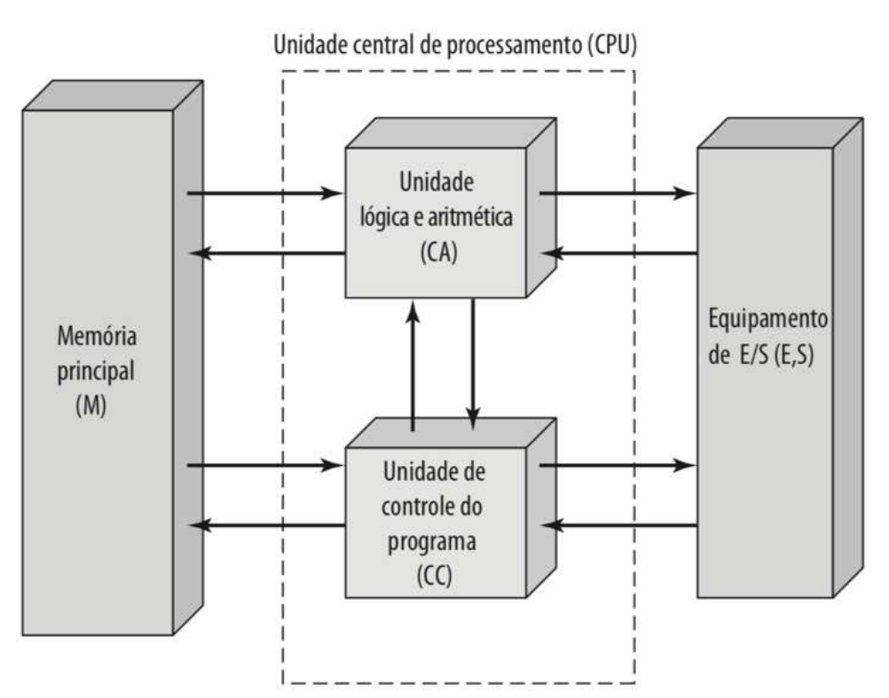
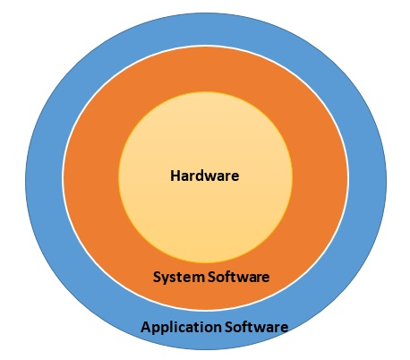
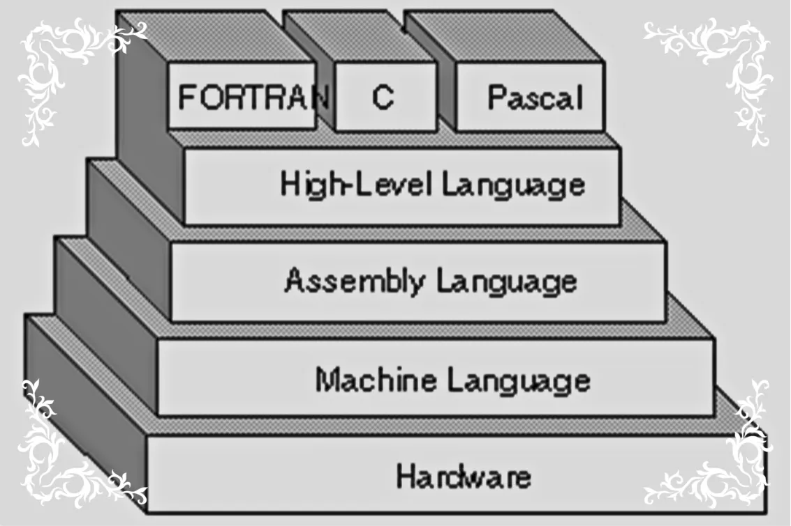

## Surgimento e Evolução dos Computadores

Os primeiros dispositivos adotados pelo ser humano com intuito de trabalhar com informações era puramente mecânicos. Antes do advento da eletricidade, apenas engrenagens e outros dispositivos mecânicos era conhecidos, sua produção contudo era demasiado complexa e cara.

### Máquina de Anticítera

Um computador analógico datado de 87 a.C. capaz de prever eventos astronômicos de forma razoavelmente precisa. Era composto de 37 engrenagens de bronze e foi recuperado em 1901 de um naugráfio próximo à costa da ilha grega de Anticítera

### Máquina Analítica

Conceito elaborado pelo matemático britânico Charles Babbage, entre 1834 e 1837, a partir de um projeto anterior que ele mesmo havia idealizado – a Máquina Diferencial. É considerado o primeiro projeto conceitual de um **computador de uso geral**. Foi desenvolvido para reolve qualquer tipo de problema matemático e executar operações lógicas complexas.

O projeto incorporava uma unidade lógica aritmética, memória interna e controle de fluxo, e introduzia a programação através de cartões perfurados. Embora não tenha chegado a ser construído, sua descrição ganhou muita notoriedade na época, com a versão inglesa sendo extensivamente anotada pela matemática Ada Lovelace. A partir dela, Ada desenvolveu o **primeiro algoritimo**, um método de cálculo de números de Bernoulli.

### Máquina de Turing

Desenvolvida durante a Segunda Guerra Mundial – no ano de 1940 –, a "Bombe" foi um dispositivo eletromecânico desenvolvido por Alan Turing, utilizado com o objetivo de decodificar as mensagens criptografadas do exército alemão. O dispositivo testava bilhões de configurações diariamente para descobrir a chave de segurança das mensagens.

### ENIAC

O ENIAC (_Electronic Numerical Integrator Computer_) foi desenvolvido entre 1943 e 1945 tinha como objetivo o cálculo rápido de trajetórias balisticas com parte do esforço de guerra dos aliados. Ele era composto por 18,000 **vávulas termiônicas** (tubos de vácuo) e consumia cerca de 160 kW. Tinha poder de processamento para realizar 5,000 adições, 357 multiplicações e 38 divisões por segundo. Sua programação contudo era feita via hardware através do rearranjamento de interruptores e conexões de cabos.

### IAS ou Máquina de von Newmann

Contruído pelo Instituto de Estudos Avançados de Princeton (IAS), com projeto e supervisão do matmático John von Newmann, entrou em operação em 1952.  É conhecido por ser um dos primeiros computadores com o conceito de "programa armazenado", no qual as intruções e os dados dividem a mesma memória. A chamada "Máquina de von Newmann" é o modelo teórico que serve como base para o projeto de praticamente todos os computadores atuais.

### Transistores

Os computadores baseados em válvulas termiônicas tinham três desvantagens principais: a baixa confiabilidade – causada por falhas nos contatos ou mesmo queima das válvulas –, alto custo energético e grande volume ocupado. Estes problemas foram resolvidos com a invenção e adoção do **transistor** durante a década de 1950.

Os computadores transistorados trouxeram algumas novdades, dentre as quais os registradores de índices para controle de _loops_ e as unidadas de ponto flutuante (para cálculos de números fracionais). Contudo, eram demasiadamente caros, sendo possuídos apenas por setores governamentais e universidades.

### Circuitos Integrados (CI)

Os **circuitos integrados** (CI), chamados popularmente de _chips_, correspondem ao encapsulamento de diversos transistores numa única pastilha de silício. Foram introduzidos no final da década de 60 e permitiram uma redução ainda maior do tamanho e do gasto energético dos computadores. Com isso se tornaram compactos o suficiente para as empresas de médio porte,.

### Microprocessadores

Em novembro de 1971, a Intel lançou o 4004, o **primeiro microprocessador comercial do mundo**. Ele contava com 2,300 transistores, sendo capaz de executar entre 46,300 e 92,600 intruções por segundo. Isso marcou a integração de toda a CPU num único chip de silício e perimitu o surgimento dos **computadores pessoais** (PCs) usados atualmente.

---
## Conceitos Básicos

Um **computador** é uma máquina eletrônica capaz de sistematicamente coletar, armazenar, maniplar e fornecer os resultados da manipulação de **dados**. Para processar os dados, o computador conta com um **conjunto de instruções** para produzir resultados completos com o mínimo de intervenção humana.

Um sistema baseado em computador é composto por ***Hardware*** – a parte física do computador – e ***Software*** – a parte lógica, i.e., os programas que gerenciam o comportamento do Hardware.

### Componentes de *Hardware*

Podemos dividi-los em 3 classes principais: CPU (Unidade Central de Processamento), memórias e unidades de entrada e saída.

#### Unidades de Entrada e Saída

As **unidades de entrada** (*input*) são os dispositivos físicos que capturam os dados a serem processados. Estes dados podem ser do tipo texto, imagem, áudio, sinais de um sensor etc. Dentre eles cabe citar: mouse, teclado, *scanner*, microfone, dentre outros.

As **unidades de saída** (*output*) apresentam os resultados finais do processamento dos dados. Podemos citar: monitor, auto-falante, impressoras, *plotters* e outros.

Exitem também os dispositivos que se encaixam em ambas categorias, p.ex., unidades de disco, unidades de leitura e gravação de CD e DVD, telas sensíveis ao toque etc.

#### Memória

Responsável pelo armazenamento dos dados e dos programas (instruções) para processá-los. A memória de um sistema computacional trabalha essencialmente com *bits*. Um *bit* pode assumir os valores de `0` ou `1`. Em termos físicos, componetes eletrônicos baseados em CMOS interpretam tensão entre 0 e 1/3 como valor 0, e de 2/3 a 1 como 1. Com isso, é possível reduzir substancialmente a propagação de erros causados por problemas elétricos, por exemplo.

Para representar informações mais complexas, os *bits* são combinados em um conjunto de oito, que recebe a denominação de *byte*. Um conjunto de 2 *bits* consegue armazenar até 2⁸ = 256 valores diferentes. A partir daí, conjuntos cada vez maiores podem ser feitos combinando um número cada vez maior de *bits*/*bytes*:

| Nome     | Símbolo | Valor         |
|----------|---------|---------------|
| byte     | B       | 8 bits (2³)   |
| kilobyte | kB      | 1024 B (2¹⁰)  |
| megabyte | MB      | 1024 kB (2¹⁰) |
| gigabyte | GB      | 1024 MB (2¹⁰) |
| terabyte | TB      | 1024 GB (2¹⁰) |

#### Unidade Central de Processamento

A CPU (*Central Processing Unit*), microprocessador ou processador é o componente que executa as instruções contidas na memória para realizar o processamento dos dados.

> O ciclo básico de execução de qualquer CPU é buscar a primeira instrução da memória, decodificá-la para determinar seus operandos e qual operação executar com os mesmos, executá-la e então buscar, decodificar e executar a instrução subsequente (TANEMBAUM, 2003).

A CPU é composta pelos seguintes componentes:

- **ULA** – Unidade Lógica e Aritmética (*Arithmetic and Logic Unit*): responável por todas as operações aritméticas – soma, subtração, multiplicação etc –, relacionais – se um número é menor, maior ou igual a outro – e lógicas (boolianas) que um computador realiza.
- **UC** – Unidade de Controle (*Control Unit*): responsável por controlar as buscas das instruções e sincronizar a execução.

### Componentes de *Software*

Um programa de computador pode ser definido como uma série de isntruções, em forma inteligível pelo computador, preparada para obter certos resultados. Um programa individualmente pode ser considerado um *software*, porém esse termo também pode ser empregado para a designação de um grupo ou mesmo todo o conjunto dos programas de um computador.

#### *Software* básico

São *software* destinados à operação do computador, i.e., são eles que gerenciam os recursos do *hardware* e permitirem que outros programas possam ser executados.

Dentre eles cabe destacar:

- **Sistema Operacional** – SO: *software* principal que gerencia todo o funcionamento do computador. Dentre suas funções, cabe destacar:
	- Gerenciamento da memória
	- Controle dos processos
	- Controle de *input* e *outpput*
	- Acesso a arquivos
	- Segurança dos dados
	- Interpretação de comandos
- ***Drivers* de dispositivos** – *Device divers*: responsáveis por intermediar a comunicação entre o SO e um componente de hardware, como adaptadores de vídeo, placas de rede, impressoras etc.

#### *Software* aplicativo

Projetados para executar tarefas específicas para o usuário final. Dependem do *software* básico para seu funcionamento.

Podemos citar:

- Navegadores de internet
- Editores de texto
- Planilhas
- Editores de imagem
- Modeladores 3D
- Programas de CAD
- Gerenciadores de Banco de Dados
- E muitos outros...

### Níveis de Programação

Há três diferentes **níveis de abstração** na programação de computadores: linguagem de máquina, linguagem de montagem, linguagem de alto nível. Quanto mais subimos o nível de abstração, mais a linguagem se torna próxima à da lógica humana e mais afastada dos detalhes físicos do hardware.

#### Linguagem de máquina

É a linguagem nativa do computador, formada por instruções em código binárias embutidas na própria arquitetura. Por ser tão dependente da arquitetura do computador, ela apresenta baixa portabilidade, com um código em linguagem de máquina escrito para determinada arquitetura só podendo ser usado em computadores que compartilham a mesma arquitetura.

#### Linguagem de montagem (_Assembly_)

Utiliza representações mnemônicas (palavras curtas, normalmente em inglês) para representar instruções binárias. Cada instrução em _Assembly_ corresponde a uma instrução em linguagem de máquina, sendo por isso também dependente da arquitetura do computador. Contudo, como a máquina não executa diretamente o _Assembly_ é necessário um _software_ chamado de **_Assembler_** (montador) que traduz este código para instruções de máquina.

#### Linguagens de alto nível (_High Level Languages_ - HLL)

São as linguagens que os programadores utilizam no dia a dia, como C, Java e Python. São muito mais próximas da linguagem e da lógica humana e possui termos em inglês estruturados (como  `if`, `while`, `function`). Precisam passar por um processo de tradução feito por **compiladores** ou **interpretadores**  que transformam o código escrito em HLL em linguagem de máquina (passando ou não pelo _Assembly_ no meio do caminho). Por não serem dependentes de arquitetura, são altamente portáveis, podendo ser executados em computadores _desktop_, dispositivos móveis e até mesmo em sistemas embarcados.

---

## Unidade Central de Processamento (CPU)

---
## Dispositivos de Entrada/ Saída (E/S)

> Os dispositivos de E/S (Entrada e Saída) são constituídos, geralmente, de duas partes: o controlador e o dispositivo propriamente dito. O controlador é um chip ou um conjunto de chips que controla fisicamente o dispositivo; ele recebe comandos do sistema operacional (software), por exemplo, para ler dados dos dispositivos e para enviá-los (TANEMBAUM, 2003).