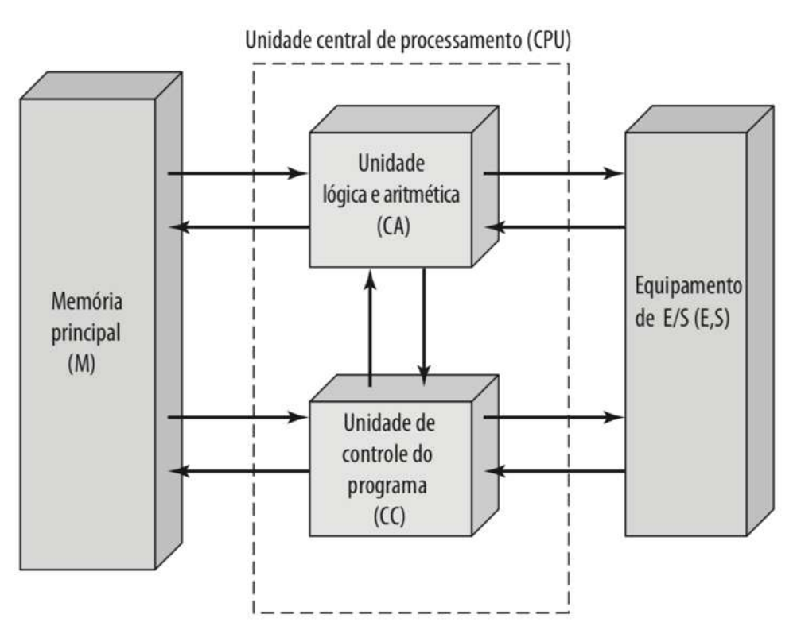
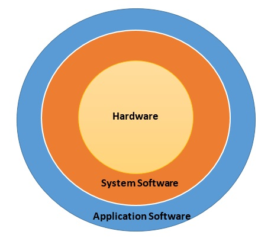
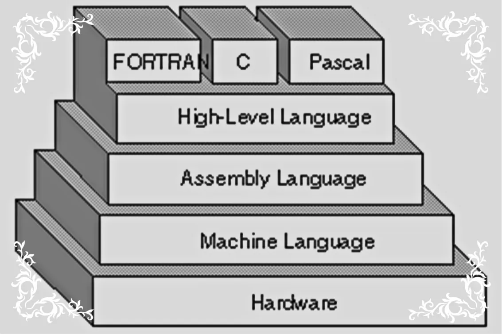
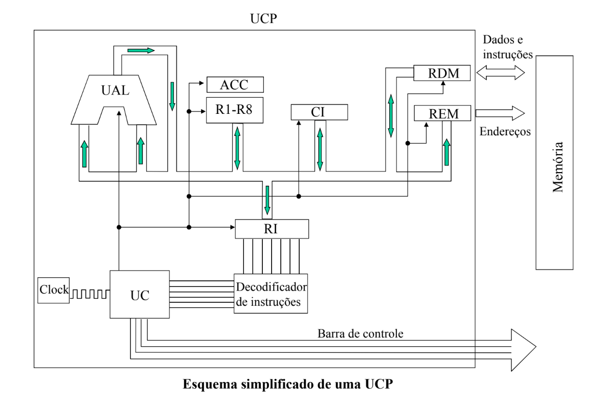
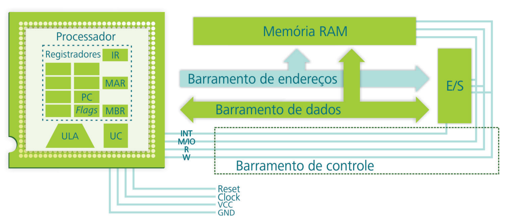
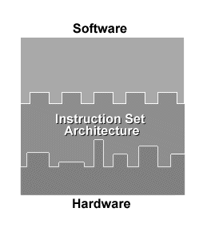
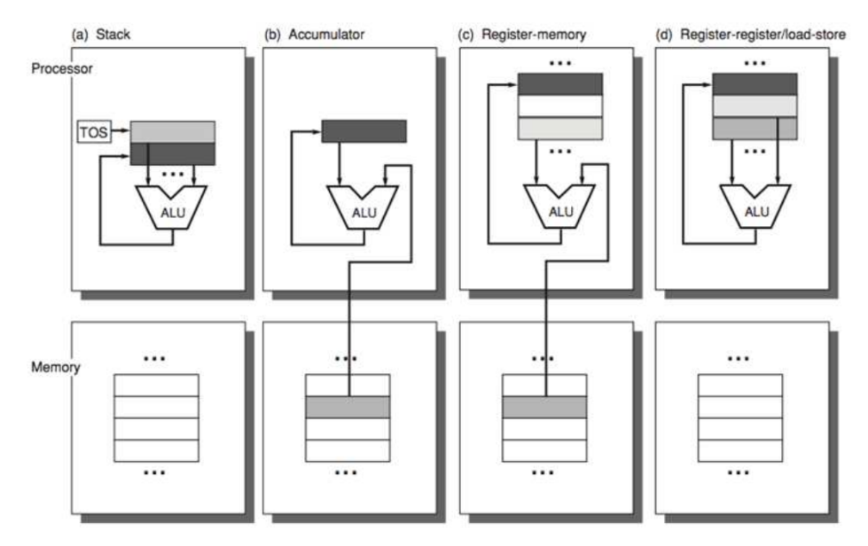

## Surgimento e Evolução dos Computadores

Os primeiros dispositivos adotados pelo ser humano com intuito de trabalhar com informações era puramente mecânicos. Antes do advento da eletricidade, apenas engrenagens e outros dispositivos mecânicos era conhecidos, sua produção contudo era demasiado complexa e cara.

### Máquina de Anticítera

Um computador analógico datado de 87 a.C. capaz de prever eventos astronômicos de forma razoavelmente precisa. Era composto de 37 engrenagens de bronze e foi recuperado em 1901 de um naugrágio próximo à costa da ilha grega de Anticítera

### Máquina Analítica

Conceito elaborado pelo matemático britânico Charles Babbage, entre 1834 e 1837, a partir de um projeto anterior que ele mesmo havia idealizado – a Máquina Diferencial. É considerado o primeiro projeto conceitual de um **computador de uso geral**. Foi desenvolvido para resolver qualquer tipo de problema matemático e executar operações lógicas complexas.

O projeto incorporava uma unidade lógica aritmética, memória interna e controle de fluxo, e introduzia a programação através de cartões perfurados. Embora não tenha chegado a ser construído, sua descrição ganhou muita notoriedade na época, com a versão inglesa sendo extensivamente anotada pela matemática Ada Lovelace. A partir dela, Ada desenvolveu o **primeiro algoritmo**, um método de cálculo de números de Bernoulli.

### Máquina de Turing

Desenvolvida durante a Segunda Guerra Mundial – no ano de 1940 –, a "Bombe" foi um dispositivo eletromecânico desenvolvido por Alan Turing, utilizado com o objetivo de decodificar as mensagens criptografadas do exército alemão. O dispositivo testava bilhões de configurações diariamente para descobrir a chave de segurança das mensagens.

### ENIAC

O ENIAC (_Electronic Numerical Integrator Computer_) foi desenvolvido entre 1943 e 1945 tinha como objetivo o cálculo rápido de trajetórias balísticas com parte do esforço de guerra dos aliados. Ele era composto por 18,000 ** válvulas termiônicas** (tubos de vácuo) e consumia cerca de 160 kW. Tinha poder de processamento para realizar 5,000 adições, 357 multiplicações e 38 divisões por segundo. Sua programação contudo era feita via hardware através do rearranjamento de interruptores e conexões de cabos.

### IAS ou Máquina de von Newmann

Construído pelo Instituto de Estudos Avançados de Princeton (IAS), com projeto e supervisão do metemático John von Newmann, entrou em operação em 1952.  É conhecido por ser um dos primeiros computadores com o conceito de "programa armazenado", no qual as instruções e os dados dividem a mesma memória. A chamada "Máquina de von Newmann" é o modelo teórico que serve como base para o projeto de praticamente todos os computadores atuais.

### Transistores

Os computadores baseados em válvulas termiônicas tinham três desvantagens principais: a baixa confiabilidade – causada por falhas nos contatos ou mesmo queima das válvulas –, alto custo energético e grande volume ocupado. Estes problemas foram resolvidos com a invenção e adoção do **transistor** durante a década de 1950.

Os computadores transistorados trouxeram algumas novidades, dentre as quais os registradores de índices para controle de _loops_ e as unidades de ponto flutuante (para cálculos de números fracionais). Contudo, eram demasiadamente caros, sendo possuídos apenas por setores governamentais e universidades.

### Circuitos Integrados (CI)

Os **circuitos integrados** (CI), chamados popularmente de _chips_, correspondem ao encapsulamento de diversos transistores numa única pastilha de silício. Foram introduzidos no final da década de 60 e permitiram uma redução ainda maior do tamanho e do gasto energético dos computadores. Com isso se tornaram compactos o suficiente para as empresas de médio porte,.

### Microprocessadores

Em novembro de 1971, a Intel lançou o 4004, o **primeiro microprocessador comercial do mundo**. Ele contava com 2,300 transistores, sendo capaz de executar entre 46,300 e 92,600 instruções por segundo. Isso marcou a integração de toda a CPU num único chip de silício e permitiu o surgimento dos **computadores pessoais** (PCs) usados atualmente.

---
## Conceitos Básicos

Um **computador** é uma máquina eletrônica capaz de sistematicamente coletar, armazenar, manipular e fornecer os resultados da manipulação de **dados**. Para processar os dados, o computador conta com um **conjunto de instruções** para produzir resultados completos com o mínimo de intervenção humana.

Um sistema baseado em computador é composto por ***Hardware*** – a parte física do computador – e ***Software*** – a parte lógica, i.e., os programas que gerenciam o comportamento do Hardware.

### Componentes de *Hardware*

Podemos dividi-los em 3 classes principais: CPU (Unidade Central de Processamento), memórias e unidades de entrada e saída.

#### Unidades de Entrada e Saída

As **unidades de entrada** (*input*) são os dispositivos físicos que capturam os dados a serem processados. Estes dados podem ser do tipo texto, imagem, áudio, sinais de um sensor etc. Dentre eles cabe citar: mouse, teclado, *scanner*, microfone, dentre outros.

As **unidades de saída** (*output*) apresentam os resultados finais do processamento dos dados. Podemos citar: monitor, auto-falante, impressoras, *plotters* e outros.

Existem também os dispositivos que se encaixam em ambas categorias, p.ex., unidades de disco, unidades de leitura e gravação de CD e DVD, telas sensíveis ao toque etc.

#### Memória

Responsável pelo armazenamento dos dados e dos programas (instruções) para processá-los. A memória de um sistema computacional trabalha essencialmente com *bits*. Um *bit* pode assumir os valores de `0` ou `1`. Em termos físicos, componentes eletrônicos baseados em CMOS interpretam tensão entre 0 e 1/3 como valor 0, e de 2/3 a 1 como 1. Com isso, é possível reduzir substancialmente a propagação de erros causados por problemas elétricos, por exemplo.

Para representar informações mais complexas, os *bits* são combinados em um conjunto de oito, que recebe a denominação de *byte*. Um conjunto de 2 *bits* consegue armazenar até 2⁸ = 256 valores diferentes. A partir daí, conjuntos cada vez maiores podem ser feitos combinando um número cada vez maior de *bits*/*bytes*:

| Nome     | Símbolo | Valor         |
|----------|---------|---------------|
| byte     | B       | 8 bits (2³)   |
| kilobyte | kB      | 1024 B (2¹⁰)  |
| megabyte | MB      | 1024 kB (2¹⁰) |
| gigabyte | GB      | 1024 MB (2¹⁰) |
| terabyte | TB      | 1024 GB (2¹⁰) |

#### Unidade Central de Processamento

A CPU (*Central Processing Unit*), microprocessador ou processador é o componente que executa as instruções contidas na memória para realizar o processamento dos dados.

A CPU é composta pelos seguintes componentes:

- **ULA** – Unidade Lógica e Aritmética (*Arithmetic and Logic Unit*): responsável por todas as operações aritméticas, relacionais e lógicas que um computador realiza.
- **UC** – Unidade de Controle (*Control Unit*): responsável por controlar as buscas das instruções e sincronizar a execução.



### Componentes de *Software*

Um programa de computador pode ser definido como uma série de instruções, em forma inteligível pelo computador, preparada para obter certos resultados. Um programa individualmente pode ser considerado um *software*, porém esse termo também pode ser empregado para a designação de um grupo ou mesmo todo o conjunto dos programas de um computador.

#### *Software* básico

São *software* destinados à operação do computador, i.e., são eles que gerenciam os recursos do *hardware* e permitirem que outros programas possam ser executados.

Dentre eles cabe destacar:

- **Sistema Operacional** – SO: *software* principal que gerencia todo o funcionamento do computador. Dentre suas funções, cabe destacar:
	- Gerenciamento da memória
	- Controle dos processos
	- Controle de *input* e *output*
	- Acesso a arquivos
	- Segurança dos dados
	- Interpretação de comandos
- ***Drivers* de dispositivos** – *Device divers*: responsáveis por intermediar a comunicação entre o SO e um componente de hardware, como adaptadores de vídeo, placas de rede, impressoras etc.

#### *Software* aplicativo

Projetados para executar tarefas específicas para o usuário final. Dependem do *software* básico para seu funcionamento.

Podemos citar:

- Navegadores de internet
- Editores de texto
- Planilhas
- Editores de imagem
- Modeladores 3D
- Programas de CAD
- Gerenciadores de Banco de Dados
- E muitos outros...



### Níveis de Programação

Há três diferentes **níveis de abstração** na programação de computadores: linguagem de máquina, linguagem de montagem, linguagem de alto nível. Quanto mais subimos o nível de abstração, mais a linguagem se torna próxima à da lógica humana e mais afastada dos detalhes físicos do hardware.

#### Linguagem de máquina

É a linguagem nativa do computador, formada por instruções em código binárias embutidas na própria arquitetura. Por ser tão dependente da arquitetura do computador, ela apresenta baixa portabilidade, com um código em linguagem de máquina escrito para determinada arquitetura só podendo ser usado em computadores que compartilham a mesma arquitetura.

#### Linguagem de montagem (_Assembly_)

Utiliza representações mnemônicas (palavras curtas, normalmente em inglês) para representar instruções binárias. Cada instrução em _Assembly_ corresponde a uma instrução em linguagem de máquina, sendo por isso também dependente da arquitetura do computador. Contudo, como a máquina não executa diretamente o _Assembly_ é necessário um _software_ chamado de **_Assembler_** (montador) que traduz este código para instruções de máquina.

#### Linguagens de alto nível (_High Level Languages_ - HLL)

São as linguagens que os programadores utilizam no dia a dia, como C, Java e Python. São muito mais próximas da linguagem e da lógica humana e possui termos em inglês estruturados (como  `if`, `while`, `function`). Precisam passar por um processo de tradução feito por **compiladores** ou **interpretadores**  que transformam o código escrito em HLL em linguagem de máquina (passando ou não pelo _Assembly_ no meio do caminho). Por não serem dependentes de arquitetura, são altamente portáveis, podendo ser executados em computadores _desktop_, dispositivos móveis e até mesmo em sistemas embarcados.



---

## Unidade Central de Processamento (CPU)

Dentre as operações realizadas por uma CPU podemos citar:

- **Operações aritméticas e lógicas** : soma, subtração, divisão, multiplicação, comparação entre números e operações de lógica booleana.
- **Operações de movimentação de dados**: mover um dado de um local de armazenamento para outro.
- **Operações de entrada e saída**: transferir valores para um dispositivo de saída ou a partir de um dispositivo de entrada para o processador.

> O ciclo básico de execução de qualquer CPU é buscar a primeira instrução da memória, decodificá-la para determinar seus operandos e qual operação executar com os mesmos, executá-la e então buscar, decodificar e executar a instrução subsequente (TANEMBAUM, 2003).
> 

Para executar uma instrução, um computador realiza as seguintes operações:

- **Busca da instrução** na memória;
- **Interpretação da instrução**, i.e., a instrução é decodificada para determinar que ação deve ser executada;
- **Obtenção dos dados** da memória ou de um dispositivo de entrada, quando necessário;
- **Processamento dos dados** por operações aritméticas e lógicas;
- **Gravação dos dados** na memória ou num dispositivo de saída.

### Sinal de _clock_

É um pulso digital – i.e., uma alternação entre tensões altas e baixas – que serve para sincronizar todas as atividades do sistema. a frequência do *clock* é medida em hertz (Hz) ou **ciclos por segundos**. Um sinal de 1Hz alterna uma vez por segundo, um de 1,000,000 Hz (ou 1 MHz) alterna 1,000,000 por segundo. O período do sinal de *clock* é inverso à frequência e representa a menor unidade de tempo perceptível num sistema. Ou seja, todas as ações ocorrem em intervalos de tempo múltiplos inteiros do período de *clock*.

### Unidade Lógica Aritmética (ULA)

Responsável pelas operações de soma, subtração, multiplicação, divisão e demais cálculos matemáticos, comparações entre números e operações booleanas que o processador realiza.

### Unidade de Controle (UC)

Responsável pela **busca e decodificação** das instruções a serem realizadas pela CPU na memória principal, e pelo fluxo de dados entre a CPU e os demais componentes do sistema.

### Registradores

São posições de memória dentro do processador que armazenam temporariamente os dados processados e algumas informações de controle necessárias para o funcionamento da CPU.

Os registradores podem ser:

- **De uso geral**: sua finalidade é decidida pelo próprio programador ou pelo compilador. Podem armazenar dados ou endereços na memória
- **Acumulador** (ACC – *Accumulator*): responsável por armazenar os resultados da última operação (matemática ou lógica) realizada pela ULA.
- **Contador de Programas** (PC – *Program Counter*): contém o endereço da próxima instrução a ser executada.
- **Registrador de Instrução** (RI ou IR – *Instruction Register*): contém a instrução que está sendo executada.
- **Registrador de Endereço de Memória** (REM ou MAR – *Memory Address Register*): contém o endereço de uma posição na memória.
- **Registrador de Dados de Memória** (RDM ou MBR - *Memory Buffer Register*): armazena um dado que acabou de ser lido ou está esperando para ser escrito na memória.
- **_Flags_ ou estado do programa** (PSW – *Program Status Word*): contém a informação do estado do programa e da última operação matemática ou lógica.




### Barramentos

São linhas de **comunicação** entre os componentes de um sistema computacional. Fisicamente são componentes metálicos que permitem que a eletricidade passe de um componente para outro. A comunicação entre os próprios componentes internos da CPU acontece pelo **_datapath_ interno**.

A comunicação entre a CPU e os demais componentes do sistema ocorre por três barramentos:

- **Barramento de dados** – através dele trafegam os dados transmitidos entre CPU e a memória ou os dispositivos de entrada/saída.
- **Barramento de endereços** – carrega os dados do endereço a ser acessado no dispositivo com o qual a CPU está se comunicando.
- **Barramento de controle** – contém diversos sinais de controle operacional entre os dispositivos que compõem o sistema. Os principais sinais do barramento de controle são:
	- indicar se a operação se referre à memória ou a E/S (I/O);
	- indicar se é uma operação de leitura (_read_);
	- indicar se é uma operação de escrita (*write*);
	-  indicar uma **interrupção**, i.e., quando um dispositivo de baixa prioridade requer acesso à CPU;
	- indicar que a CPU aceitou o pedido de interrupção;
	- indicar se um dispositivo requer acesso ao barramento de dados;
	- indicar se a CPU garantiu acesso ao barramento de dados;
	- realizar um *hard reboot* (*reset*) do sistema;
	- dentre outros.




### Arquitetura do Conjunto de Instruções – ISA

A *Instruction Set Architecture* – ISA é um modelo abstrato que define como **_software_ e _hardware_ se comunicam** em um computador, i.e., define as regras para codificar e interpretar as instruções de máquina.  



É ela que define as:
- **Conjunto de instruções**:  todas as instruções que uma CPU pode realizar (operações aritméticas, lógicas, controle de E/S, operações na memória);
- **Formato das instruções**: o *layout* que define – a nível de *bit* – *opcodes*, operandos and modos de acesso;
-  **Registradores**: número, tipo e função (propósito geral, porno-flutuante, função específica);
- **Tipos de dados**: como inteiros, ponto-flutuante, vetores etc;
- **Arquitetura de memória**: modos de endereçamento, *endianness* (modo como um computador organiza na memória pedaços de dados formados por mais de um *byte*), proteção de memória e suporte a memória virtual;
- **Gerenciamento de interrupções e de exceções**: usados para gerenciar eventos assíncronos e condições de falha.

Mesmo possuindo diferentes microarquiteturas, duas CPUs que compartilham a mesma ISA são capazes de executar os mesmos softwares, o que permite uma maior **portabilidade e abstração de *hardware***. Uma ISA pode ser estendida para suportar novas capacidades enquanto mantém **retrocompatibilidade** – permitindo melhora no *design* das CPUs sem quebrar os *softwares* já existentes.

#### CISC *vs* RISC

De acordo com o tipo de instrução, um computador pode ser:

- **_Complex Instruction Set Computer_** (Computador de Conjunto de Instruções Complexo – CISC) – são baseados em **microprogramação**, uma técnica que utiliza um conjunto de instruções internos que traduz as instruções de máquina em tarefas que são efetivamente realizadas pelos circuitos da CPU. Cada instrução do código de máquina corresponde a várias instruções num nível ainda mais baixo.
- **_Reduced Instruction Set Computer_** (Computador de Conjunto de Instruções Reduzido – RISC) – possuem um conjunto de instruções mais simples e menor, com cada instrução levando aproximadamente o mesmo tempo para ser executada. Não possuem microprogramação e cada instrução de máquina é diretamente executada pelo *hardware*. Como as instruções ativam os circuitos diretamente por portas lógicas (sem intermediários), sua execução torna-se mais rápida.

Muitos processadores modernos adotam uma implementação híbrida, na qual as instruções CISC são quebradas em micro-operações mais simples, executadas por núcleos internos no estilo RISC.
#### Modelos de Organização dos Operandos

Define o modo como a CPU busca os daods (operandos) para fazer uma operação e onde ele armazena o resultado.



##### Pilha  (*Stack*)

Neste modelo os dados ficam no topo de uma estrutura de dados do tipo **Pilha (LIFO)** na memória ou em registradores especiais. Nela as instruções não precisam declarar endereços ou registradores. Uma operação como `ADD` remove automaticamente os dois items do topo da pilha, faz a soma e coloca o resultado de volta no topo.

Exemplo de código para a operação $C = A + B$ :

```assembly
PUSH A  ; Coloca o valor de A na pilha
PUSH B  ; Coloca o valor de B na pilha
ADD     ; Remove A e B, soma, e coloca o resultado na pilha
POP C   ; Remove o resultado da pilha e salva em C
```
##### Acumulador (*accumulator* – ACC)

Usa um registrador dedicado chamado **acumulador (ACC)**. Toda operação usa implicitamente o ACC como um dos operandos e também como o destino dos resultados.

```assembly
LOAD A  ; Copia o valor de A da memória para o ACC (ACC = A)
ADD B   ; Soma o valor de B da memória com o ACC (ACC = ACC + B)
STORE C ; Salva o valor atual do ACC na memória na posição C
```

##### Memória-Memória

Nessa abordagem, todos os operandos vêm direto da memória e o resultado é escrito de volta na memória.

```assembly
ADD C, A, B  ; Busca A e B na memória, soma, e salva direto em C na memória
```

##### Registrador-Registrador (*Load/Store*)

É o padrão de arquitetura modernas **RISC** (como ARM, MIPS e RISC-V). As operações ocorrem exclusivamente entre os registradores internos da CPU.

```assembly
LOAD R1, A   ; Carrega o valor da memória A no registrador R1
LOAD R2, B   ; Carrega o valor da memória B no registrador R2
ADD R3, R1, R2 ; Soma R1 com R2 e guarda o resultado em R3 (puramente interno)
STORE C, R3  ; Salva o valor de R3 na posição de memória C
```

##### Registrador-Memória

Permite que um dos operandos venha da memória enquanto o outro está em um registrador.

```assembly
LOAD R1, A  ; Coloca A no registrador R1
ADD R1, B   ; Busca B na memória, soma com R1 e atualiza R1 (R1 = R1 + B)
STORE C, R1 ; Salva R1 na memória na posição C
```

Exemplo de implementação de uma ISA com MIPS:


#### Microaquitetura

Também chamada de organização do computador, a **microaquitetura** é a forma como a ISA é implementada fisicamente numa CPU específica. É o *design* interno do processador, como ele transforma as instruções em execução real.

É ela que define como será a ULA, o **_datapath_** (caminho de dados – forma como os dados são transportados e processados dentro do processador), **memória cache**, **decodificação das instruções**, **_pipeline_**, **_branch prediction_** (predições de desvios), **execução _out-of-order_** (fora de ordem), dentre outros.

### Desempenho, *Multicore* e *Pipeline*

O desempenho de uma CPU depende basicamente de dois fatores: o número de **instruções por ciclo** (IPC) e da **frequência de _clock_**.

$$
Desempenho = IPC \cdot \text{frequência de clock}
$$

Onde o IPC mede basicamente quantas instruções a CPU consegue executar a cada ciclo de *clock*, permitindo assim, mensurar a eficiência da sua microarquitetura.

Com isso, é possível afirmarmos que o aumento da frequência de *clock* gera um aumento proporcional no desempenho do sistema. Porém, esse aumento esbarra no limite da capacidade de **dissipação de calor**, pois, o aumento da frequência de _clock_ tem como consequência o aumento da potência elétrica necessária para o funcionamento do circuito.

Para tentar aumentar o desempenho de um sistema sem aumentar a frequência de *clock*, a indústria vem adotando algumas estratégias, dentre as quais:

- Aumento de _bits_ da CPU;
- Utilização de memória *cache*;
- Utilização de *pipelines*;
- Tecnologias de _multithreading_;
- Processadores _multicore_.

O aumento do número de *bits* de um processador é um estratégia que busca aumentar o tamanho de cada **palavra** (*word*) processada por ele, i.e.,  qual o número de *bits* de dados que a CPU consegue processar numa única operação. Ela altera a largura dos registradores, do barramento de dados e do espaço de endereçamento do sistema. O que por sua vez, aumenta o número de dados processados pro cada ciclo.

A utilização de **memória *cache*** permite diminuir o número de acessos à memória principal do sistema. Ela é composta por uma hierarquia de memória que armazena os dados e instruções processados mais recentemente e aqueles que estão próximos. Como a velocidade de acesso a esta memória é bem superior à da memória principal, isto reduz o tempo que a CPU precisa ficar ociosa esperando que os dados e instruções sejam buscados.

O termo **_pipeline_** se refere a uma técnica que permite que várias instruções sejam sobrepostas e executadas simultaneamente. Como cada instrução depende de tarefas distintas – como a busca na memória, decodificação, processamento –, esta técnica permite que cada uma delas seja executada por uma parte diferente do *hardware* de forma paralela.

A utilização de **_Multithreading_ Simultâneo** (SMT) consiste em utilizar um único núcleo de processamento (*core*) para gerenciar múltiplas linhas de execução. A nível de *hardware*, esta técnica dobra o número de registradores de uma CPU, mas mantém uma ULA e uma UC. Isto permite que, enquanto uma *thread* (tarefa) A aguarda dados serem buscados na memória principal, por exemplo, o *core* possa alternar para outra *thread* B que já tem os dados carregados, diminuindo assim o tempo que a CPU passa ociosa.

Posteriormente, foram criados os **processadores multinúcleo** (*multicore*). Sua filosofia era, dividir as tarefas entre dois ou mais núcleos computacionais, i.e., entre mais de uma CPU no mesmo CI. Como a adoção desta estratégia causou um aumento na densidade de componentes no mesmo CI, para manter a capacidade de dissipação de calor, foi necessário o uso de *clocks* mais baixos. Embora a estratégia de *multicores* consiga trazer uma melhora de desempenho, ela não melhora o tempo de execução de cada núcleo, mas consegue melhora a **vazão** (*throughput*) do sistema  – i.e., o número de tarefas realizadas num dado intervalo de tempo.


---
## Memória

> O segundo principal componente em qualquer computador é a memória. Idealmente, uma memória deve ser rápida ao extremo (mais rápida do que executar uma instrução, de maneira que a CPU não seja atrasada pela memória), abundantemente grande e muito barata. Nenhuma tecnologia atual satisfaz todas essas metas, assim uma abordagem diferente é tomada (TANEMBAUM, 2003).
> 


---
## Dispositivos de Entrada/Saída (E/S)

> Os dispositivos de E/S (Entrada e Saída) são constituídos, geralmente, de duas partes: o controlador e o dispositivo propriamente dito. O controlador é um chip ou um conjunto de chips que controla fisicamente o dispositivo; ele recebe comandos do sistema operacional (software), por exemplo, para ler dados dos dispositivos e para enviá-los (TANEMBAUM, 2003).
> 


