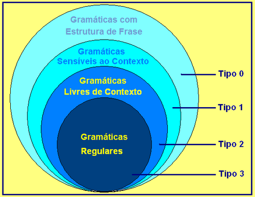
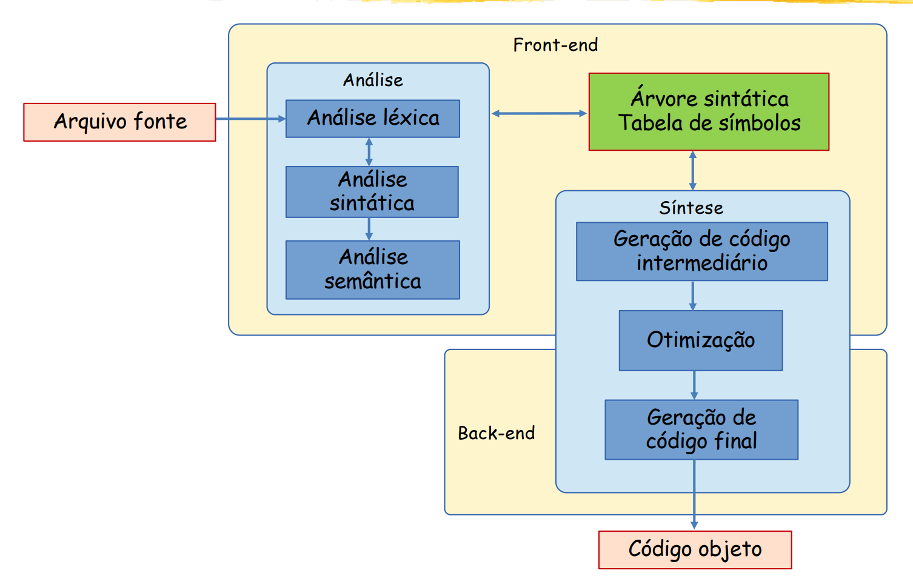

## Linguagens Formais e Autômatos

Teoria da Ciência da Computação que serve de base para compiladores, processadores de texto, e até para a compreensão dos limites das máquinas em processar informações.

### Conceitos Básicos

- **Alfabetos** ( $\Sigma$ ): um conjunto finito de símbolos. P.ex.: $\Sigma = \{a,b,c\}$ ou $\Sigma = \{0,1\}$.
- **Palavra ou cadeia (*string*)**: uma sequência finita de símbolos de um alfabeto (ex: $1001$ ou $abb$).
- **Linguagem**: conjunto de palavras formadas a partir de um alfabeto.
- **Gramática**: conjunto de regras para formar *strings* válidas em uma linguagem.
- **Autômatos**: máquinas abstratas (modelos matemáticos) capazes de verificar se uma *string* pertence ou não a determinada linguagem.

### Hierarquia de Chomsky

Criada pelo linguista Noam Chomsky no final da década de 1950 e organiza as linguagens numa hierarquia de 4 níveis:




| **Tipo** | **O que reconhece**                   | **Modelo**                          | **Memória**                       | **Não reconhece**                                                       | Usos                                                          |
| -------- | ------------------------------------- | ----------------------------------- | --------------------------------- | ----------------------------------------------------------------------- | ------------------------------------------------------------- |
| Tipo 3   | Linguagens regulares                  | Autômato Finito (AFD / AFN)         | Nenhuma (apenas o estado atual)   | aⁿbⁿ (contagem ilimitada)                                               | Expressões regulares (Regex), análise léxicos em compiladores |
| Tipo 2   | Linguagens livres de contexto         | Autômato com Pilha (PDA)            | Uma pilha (LIFO ilimitada)        | aⁿbⁿcⁿ (duas contagens simultâneas)                                     | Análise sintática em compiladores                             |
| Tipo 1   | Linuguagens sensíveis ao contexto     | Autômato Linearmente Limitado (LBA) | Fita de comprimento finito        | Linguagens com crescimento exponencial (L = { ${a}^{2^n}$ \| $n\geq0$}) | Análise de linguagens naturais simples                        |
| Tipo 0   | Linguagens recursivamente enumeráveis | Máquina de Turing                   | Fita ilimitada, leitura e escrita | Nenhuma linguagem computável — mas o Problema da Parada é indecidível   | Computadores modernos e algoritmos gerais                     |

### Apostila Explicativa


---
## Linguagens de Programação

Uma **linguagem de programação** é um conjunto de **regras sintáticas e semânticas** que permitirem implementar um software. O primeiro tipo linguagem de programação a surgir foram as **linguagens de baixo nível** (*low-level*) que mapeiam exatamente as instruções de um determinado tipo de hardware. Se subdividem nas linguagens de primeira geração (1GL) e de segunda geração (2GL). As 1GL são o próprio código de máquina, que pode ser escrito diretamente com o uso de um editor hexadeciamal.

Para solucionar a a complexidade da escrita e interpretabiliade das 1GL foram criadas as 2GL. Também chamdas de **linguagem de montagem** (*Assembly*), elas mapeiam as instruções das 1GL num conjunto de símbolos chamado de **mnemônicos**. Cada instrução das 2GL mapeiam exatamente uma instrução executada pelo hardware. Contudo, como os sistemas computacionais entendem apenas linguagem de máquina, o *Assembly* precisa passar por um programa chamado **montador** (*Assembler*) que converte esses mnemônicos em código binário.

O próximo passo foi dado com o surgimento das linguagens de terceira geração (3GL), com a capacidade de abstrair as instruções em um formato mais legível para humanos (*human readable*). Também chamadas de **linguagens programação de alto-nível** (HLL – *High-Level Programming Languages*), as 3GL e as gerações seguintes, trazem uma maior abstração das particularidades do hardware e permitem automatizar áreas mais complexas dos sistemas (como o gerenciamento de memória), além de permitirem uma maior portabilidade.

> Exemplos: C, C++, Fortran, Java, Python, JavaScript, Rust, Swift

Contudo, como os sistemas computacionais não conseguem compreender diretamente estas linguagens, elas precisam passar por algum processo de conversão ou tradução. Com isto, as HLL se dividem em **compiladas** e **interpretadas**.

### Linguagens Interpretadas

São linguagens cujo arquivo de texto escrito pelo programador – chamado de **código-fonte** – é entregue a um programa chamado **interpretador** que processa os blocos de código, linha a linha, **durante a execução**. Como o código-fonte precisa obrigatoriamente de um **ambiente de execução** (*runtime environment*), isso acaba resultando num maior consumo de recursos durante a execução, porém o torna bastante portável.

> São exemplos de linguagens interpretadas: Python, Perl,  PHP, Rust e JavaScript
### Linguagens Compiladas

Nestas linguagens, o resultado do pipeline de análise é passado para um programa chamado **compilador** que o traduz num  programa em linguagem de máquina  – chamado **código-objeto** – **antes da execução** (*ahead-of-time*). Este código-objeto pode ser transformado num arquivo executável (que pode ser executado diretamente pelo sistema operacional) ou num arquivo de biblioteca (*library*).

> São exemplos de linguagens compiladas: C, C++, Fortran, Rust, Go e Swift

Como muitas vezes o resultado da compilação pode ser executado diretamente pelo SO, sem a necessidade de um programa intermediário, sua execução tende a ser mais rápida que a de um peograma interpretado.  Mais ainda, como o compilador analisa todo o programa antes dele ser executado, ele consegue fazer uma série de **otimizações**, que melhoram ainda mais o desempenho durante a execução.

Contudo, estas linguagens tendem a ser menos portáveis, pois uma arquitetura de hardware ou um sistema operacional diferente, tendem a necessitar de um novo código objeto. Para melhorar sua portabilidade, algumas linguagens como Java, C# e VB.NET não são compiladas para código objeto mas para um **_portable code_** (*p-code* – código portátil) que é interpretado numa **máquina virtual** que faz a execução. Este  *p-code* "conversa" com o conjunto de instruções – consideravelmente compacto – de um processador hipotético/virtual. Como estes conjuntos de instruções  têm normalmente *opcodes* de 1 byte, são chamados também de **_bytecode_**.

#### Compilação *Just-in-time* (JIT)

A compilação JIT é uma tecnologia que permite unir a portabilidade e flexibilidade das linguagens interpretadas com o desempenho das linguagens compiladas. O motor JIT compila blocos do código-fonte ou *bytecode* para **código de máquina** nativo **durante a execução** do programa.

O programa começa rodando num interpretador, porém, o motor JIT o monitora em tempo de execução identificando os chamados **_Hotspots_** – trechos de código usados com frequência. A partir de um certo limite, o compilador JIT roda uma ação em segundo plano (*background thread*) que compila aquele trecho de código diretamente para código de máquina nativo da CPU.

>São exemplos de compiladores JIT a JVM (Java Virtual Machine) – que executa *bytecode* Java – e Engine V8, presente no Chrome e no Node.js – que executa JavaScript.

---
### Sistema de Tipos (*Type System*)

É o conjunto de regras de uma linguagem de programação que nos permite categorizar valores, variáveis e expressões e controlar como serão manipulados e armazenados na memória.

#### Tipos de Dados (*Data Types*)

Um sistema de tipos é baseado nos **tipos de dados**, que representa o conjunto de valores e operações  que podem ser realizadas com estes valores.

##### Tipos Primitivos

São os tipos mais fundamentais fornecidos pela linguagem e suportados, na maioria das vezes, pelo próprio conjunto de instruções da CPU. São eles:

- **Inteiro**: representam números sem parte fracionária. Normalmente podem ter 8, 16, 32 ou 64 bits dedicados a sua representação. Podem ser assinados (*signed* – suportando números negativos) ou não assinados (*unsigned*);
- **Ponto Flutuante** (*Floating-point*): representam números reais (podendo ou não conter parte fracionária). Normalmente tem 32 (*single precision*) ou 64 (*double precision*) bits de precisão, sendo representados seguindo as normas da IEEE 754 – que define como os bits são divididos para representar sinal, expoente e mantissa;
- **Booleanos**: representam valores lógicos – verdadeiro ou falso, *true* ou *false*;
- **Caracteres**: representam símbolos individuais – que podem ser codificados em ASCII, UTF-8, UTF-16 etc – podendo representar sinais gráficos ou de controle (como quebra de linha, tabulação e outros).

##### Tipos Estruturados ou Derivados

São criados a partir da combinação de tipos primitivos:

- **_Arrays_ /  Vetores**: representam uma sequência **contínua** de elementos do **mesmo tipo** na memória;
- ***Strings***: um tipo especial de vetor dedicado a representar uma cadeia de **caracteres**;
- **Ponteiros** (*pointers*): armazenam um valor que "aponta para" um dado armazenado na memória usando seu endereço;
- **Tipos definidos pelo usuário** (*struct*|*enum*|*class*): permitem ao programador combinar tipos de dados primitivos para atender a alguma necessidade específica.

##### Tipo de Dado Abstrato (ADT - *Abstract Data Type*)

Conceito **puramente teórico e abstrato** presente nas HLL mais modernas que define um tipo de dado não pela sua implementação interna (o que ele é), mas pelo seu comportamento (o que ele faz). Em outras palavras o que define um tipo de dado é a interface – i.e., o conjunto das operações – que nos permite interagir com ele.

#### Tipagem

Nas diferentes HLL, uma variável pode ter seu tipo de dado associado diretamente a ela ou não. Chamamos de tipagem **estática** (*static*) quando uma variável é associada a um tipo específico de valores. Por exemplo, uma variável associada ao tipo inteiro só pode armazenar este tipo de dado – como ocorre em C, C++, Rust, Go, Pascal, Java, TypeScript. É muito comum em linguagens compiladas, permitindo que a verificação de tipos seja analisada já durante a fase da análise semântica e permitem um melhor desempenho.

Quando o tipo não está associado diretamente à variável, mas aos próprios valores armazenados por elas, dizemos que a tipagem é **dinâmica** (*dynamic*). Neste caso, a variável é apenas um rótulo e o tipo de dado armazenado por ela pode ser alterado ao longo do programa. São exemplos de linguagens que usam tipagem dinâmica Python, JavaScript, Ruby, Julia e PHP. Este tipo de tipagem é mais comum em linguagens interpretadas e permite uma maior flexibilidade.

Quanto à atribuição do tipo de uma variável, a tipagem pode ser explicita ou inferida. Nas linguagens com tipagem **explícita** (*explicit*) ou *manifest* – como C, Pascal, Java (tradicional) – o programador é obrigado a escrever (explicitamente) o tipo de dado que uma variável irá armazenar. Já na tipagem **inferida** (*inferred*), o próprio compilador ou interpretador deduz (infere) o tipo de dado da variável com base na primeira atribuição. A tipagem *inferred* está presente em linguagens como TypeScript, Java (moderno – `var`), Julia e Rust.

Nas linguagens com tipagem estática, o modo como um compilador ou interpretador precisa verificar se dois tipos são iguais ou compatíveis para realizar determinada operação. Na tipagem nominal (_nominative_) dois tipos são iguais somente se tiverem o mesmo “nome” ou se houver alguma declaração explícita – como acontece em linguagens como Java, C++ e Julia. Já na tipagem estrutural (*structural*), dois tipos são considerados iguais se tiverem a mesma estrutura, i.e., se tiverem o mesmo conteúdo –  está presente em TypeScript, Rust e Go.

Já nas linguagens dinâmicas há a presença do chamado *duck typing*, no qual é empregado o teste do pato (*duck test*) – “se anda como um pato e faz quack como um pato, então é um pato” – para determinar se um dado pode ser usado numa operação específica. São exemplos de linguagens que o usam Python, Ruby, JavaScript. Seu funcionamento é semelhante ao *structural typing*, com a diferença de que a verificação não é feita no momento da compilação, mas durante a execução, e de que não é verificado o tipo do dado, apenas sua compatibilidade com a operação.

#### Segurança de Tipos (*Type Safety*)

Pode ser definida como o grau que uma linguagem desencoraja ou previne **erros de tipos** (*type erros*), garantindo que um programa não tentará realizar operações inválidas sobre os dados – como tentar somar uma *string* e um inteiro. Uma linguagem com maior segurança de tipos – também chamada de **fortemente tipada** (*strong typing*)  – não permite que operações com dados incompatíveis sejam realizadas, lançando uma exceção na compilação – como é o caso do Java, Rust, Go e TypeScript – ou execução do código – Python, Rust e Julia. 

Em linguagens consideradas  **fracamente tipadas** – também chamadas de *type-unsafe* – tentam "adivinhar" o resultado esperado e realizam conversões de tipo automáticas, como o JavaScript e o PHP. Outras linguagens como C/C++ permitem manipulações de endereços brutos de memória (ponteiros), permitindo fazer *casting* (coerção) sem nenhuma verificação de tipos. Quanto maior a tipagem de uma linguagem, menor a chance de gerar resultados imprevisíveis e quebrar o programa.

Algumas linguagens como Rust e Go tem uma segurança de tipos ainda maior a nível de compilador. Diferente de linguagens como Java e Python que promovem uma conversão implícita de tipos numéricos – or exemplo, permitindo que um número inteiro e um de ponto flutuante sejam somados, resultando num número de ponto flutuante –, estas linguagens obrigam que estas conversões sem feitas de maneira explícita, ou a compilação é abortada na análise semântica. Em Rust a segurança é ainda mais extrema, impedindo implícitas até entre inteiros de tamanhos diferentes (um inteiro de 32-bits e um de 64-bits não podem ser usados na mesma operação sem uma conversão explícita).

### Propósitos de Uso e Paradigmas de Programação

Quanto ao propósito, existem basicamente dois tipos de linguagens de programação:

- **Linguagens de Propósito General** (GPL – *general-purpose languages*) – capazes de serem usadas para desenvolver software em diferentes domínios de aplicação. Sendo caracterizadas por serem **_Turing complete_** , i.e., podendo computar qualquer algoritmo teoricamente possível. São exemplos: C/C++, Java, Python, JavaScript, Rust, Go, Julia, dentre outros.
- **Linguagens de Domínio Específico** (DSL – *domain-specific language*) – feitas para resolver algum problema num domínio particular. São exemplos: SQL HTML, CSS, Expressões Regulares (Regex) e LaTex. Não são *Turing complete* e são consideradas puramente declarativas – indicando apenas o que deve ser feito.

Já quanto ao paradigma, as linguagens de programação se dividem em dois ramos principais:

```text
                        Paradigmas de Programação
                                   │
         ┌─────────────────────────┴─────────────────────────┐
         ▼                                                   ▼
 PARADIGMAS IMPERATIVOS                               PARADIGMAS DECLARATIVOS
 ("COMO" resolver o problema)                         ("O QUE" deve ser resolvido)
 │                                                    │
 ├─ Estruturado                                       ├─ Funcional (ex: Haskell)
 ├─ Procedural (ex: C, Pascal, Fortran clássico)      ├─ Lógico (ex: Prolog)
 └─ Orientado a Objetos (POO | ex: Java)              └─ DSLs (ex: SQL, HTML, CSS)
```

#### Paradigmas Imperativos

Focam no modo como o problema deve ser resolvido, através de comandos que manipulam estados (variáveis, memória) de um processo. Ou seja, ele descreve  – passo a passo – o controle de fluxo (*control flow*) do programa.  São subtipos:
- **Estruturado**: segue os princípios do paradigma imperativo, mas organiza o código em uma estrutura de blocos para organizar o *control flow*. Ele usa sequência, seleção (`if` – `else`) e interação (loops) para eliminar saltos randômicos ao longo do programa (`goto`).
- **Procedural**: segue os princípios do paradigma estruturado, organizando o código em procedimentos (*procedures*), também chamados de funções ou sub-rotinas, capazes de chamar uns aos outros e serem reutilizados.
- **Orientado a Objetos**: deriva do procedural e se baseia em objetos que agrupam dados (atributos) e procedimentos (métodos). São seus pilares: encapsulamento, herança, polimorfismo e abstração.

#### Paradigmas Declarativos

Estas linguagens focam em descrever a lógica do programa sem descreverem o *control flow*. Trata-se da abstração de um programa além da ordem de execução, descrevendo o resultado esperado ou a lógica da solução de um problema.
- **Funcional**: deriva do declarativo aplicando o conceito de função matemática, sem alterações de estados e sem efeitos colaterais (uma função pura retorna o mesmo resultado para os mesmos argumentos). Funções aqui são consideradas "cidadãos de primeira classe", podendo ser passadas como argumento para outras funções e/ou retornadas por elas.
- **Lógica**: também deriva do paradigma declarativo aplicando a lógica matemática, através de fatos e regras de inferência lógica.

#### Linguagens Multiparadigma  e Paradigmas Transversais

As HLL que temos hoje são, em sua maioria, multiparadigma, suportando diversos paradigmas – como Python que é imperativa, orientada a objetos e funcional. Com isso, temos também outros paradigmas, chamados de transversais, cujas características podem se aplicar a qualquer paradigma:
- **Concorrente / Paralela**: foca na execução de múltiplos fluxos de execução (*threads* ou processos) que ocorrem de maneira simultânea ou intercalada (ex: C/C++ com a lib OpenMP, Java a partir da versão 8).
- **Orientada a Eventos** (*Event-Driven*): o *control flow* é determinado por **eventos externos** e *callbacks* (ex: JavaScript esperando uma requisição HTTP, uma interface gráfica).
- **Modular**: divide um sistema grande em partes menores, independentes e reutilizáveis chamadas de **módulos** – presente em praticamente todas as linguagens hoje em dia.

---
## Compiladores

Para compilarem o **código fonte** de um programa em um **código objeto**, um compilador passa pelas seguintes fases (ou pela maioria delas): análise (léxica, sinática e semântica), geração de código intermediário – ou representação intermediária (IR – *intermediate representation*) –, otimização e geração de código final. O conjunto das três últimas etapas também é chamado de **síntese**.

É comum também a separação do compilador em duas interfaces distintas, o ***front-end*** – parte da análise e geração de IR –, que depende da HLL na qual o programa foi escrito; e o ***back-end***, que depende mais da arquitetura para a qual o programa será compilado.



Há ainda a separação no chamado ***middle-end***, que seria uma fase independente tanto da linguagem fonte (*front-end*) quanto da arquitetura objeto (*back-end*), na qual o compilador trabalharia apenas com a IR.

### Pré-Processador

Também chamado de pré-compilador (*precompiler*), vem antes do *front-end* do compilador. Suas funções acabam dependendo bastante de como foi implementado, mas o exemplo mais clássico acaba sendo o pré-processador de C/C++. Nestas linguagens, linhas que começam com `#` são diretivas de pré-processador. As principais operações realizadas por ele são:

- **Inclusão de Arquivos** (`#include`);
- **Definição de Macros e Constantes** (`#define`);
- E **Compilação Condicional** (`#ifdef`, `#ifndef`, `#endif`): que permite incluir ou ignorar blocos inteiros de código com base em condições de ambiente (como sistema operacional ou `flags` de depuração).

### *Front-End* – Pipeline de Análise

O **pipeline de análise** pelo qual um programa passa, é composte pelas seguintes fases:

```text
Texto Bruto (Código-Fonte)
    ↓
[ Análise Léxica ] ─── (Gera Tokens)
	↓
[ Análise Sintática ] ─── (Monta a Árvore Sintática / AST)
	↓
[ Análise Semântica ] ─── (Valida Significados e Tipos)
	↓
Restante da conversão
```

#### Análise Léxica (*Lexing*)

Lê o código-fonte caractere a caractere e separa as unidades mínimas com significado – os **_tokens_**. Este processo é análogo ao de separar as palavras de uma frase em uma linguagem natural e é feito pelo componente chamado ***lexer*** ou ***scanner***.

```text
Exemplo:

- Entrada: int c = a + b;

- Saída (Tokens):
    
    1. [Palavra-chave: int ]
        
    2. [Identificador: c]
        
    3. [Operador: =]
        
    4. [Identificador: a]
        
    5. [Operador: +]
        
    6. [Identificador: b]
        
    7. [Ponto-e-vírgula: ;]
```


Nesta fase também são removidos coisas irrelevantes para o computador como espaços em branco desnecessários e comentários.

#### Análise Sintática (*Parsing*)

Analisa a lista de _tokens_ extraída pelo *lexer* e verifica se ela segue as **regras sintáticas** da linguagem  – e.g., se os parênteses abertos são fechados ou se o valor a ser atribuído a uma variável está à esquerda do operador de atribuição. É um processo análogo ao de verificar se as palavras que constituem uma frase permitem transmitir um significado compreensível numa linguagem natural – uma frase coesa. Ele é feito pelo **_parser_** que retorna a chamada **Árvore Sintática Abstrata** (AST  – *Abstract Syntax Tree*).

```text
Exemplo:

- Entrada:  [Identificador: total]  [Operador: =] [Identificador: preco] [Operador: +] [Número Inteiro: 10]

- Saída (AST):
				      Operador (=)
					/              \
				   /                \
			  Identificador        Operador
			       (c)           /    (+)   \
				             	/            \
					    Identificador     Identificador
					          (a)              (b)
```

#### Análise Semântica

Analisa a AST para garantir que seguem as **regras semânticas** da linguagem – i.e., garantir que tenham um significado lógico no contexto do programa. Dentre as verificações feitas nesta etapa são as de **escopo das variáveis** e a **verificação de tipos**. Comparando às linguagens naturais, é semelhante à verificação de um conjunto de frases formarem um texto lógico e coerente. Esta fase define o tipo das variáveis (identificadores), registra o tamanho em bytes, garante que não haja duplicidade ou variáveis não declaradas num determinado escopo. Após esta análise, a AST e a **Tabela de Símbolos** são consultadas para a criação da IR (representação intermediária).

Exemplo:

| **Nome** | **Tipo**    | **Tamanho** | **Escopo**     |
| -------- | ----------- | ----------- | -------------- |
| `c`      | **integer** | 4 bytes     | Função `somar` |
| `a`      | **integer** | 4 bytes     | Função `somar` |
| `b`      | **integer** | 4 bytes     | Função `somar` |

### *Middle-End* – Geração, Análise e Otimização da IR

 Nesta fase, o compilador trabalha com a IR – um código abstrato de mais baixo nível – e faz uma nova fase de análise e de otmizações que independem da arquitetura. É nesta fase que o **Grafo de Fluxo de Controle**  (CFG – *Control-Flow Graph*) é gerado usando *labels* (rótulos) e *jumps* (desvios) para representar as estruturas de blocos estruturados presentes nas HLL. 

Atualmente, a infraestrutura de compiladores mais usada no mundo é a LLVM, que está presente em compiladores de diversas linguagens – como C/C++ (Clang), Rust, Swift – e permite a geração de código de máquina para diversas paltaformas com arquiteturas diferentes.

```text
	   ┌──────────────┐   ┌──────────────┐   ┌──────────────┐
       │   Código C   │   │  Código Rust │   │ Código Swift │
       └──────┬───────┘   └──────┬───────┘   └──────┬───────┘
              │                  │                  │
              └──────────────────┼──────────────────┘
                                 ▼
                         ┌───────────────┐
                         │   Front-End   │
                         │(Parsers / AST)│
                         └───────┬───────┘
                                 │
                                 ▼
                         ┌────────────-──┐
                         │  Middle-End   │
                         |    (LLVM)     |
                         └───────┬────-──┘
                                 │
                                 ▼
                         ┌───────────────┐
                         │   Back-End    │
                         │ (Target Gen)  │
                         └───────┬───────┘
                                 │
              ┌──────────────────┼──────────────────┐
              │                  │                  │
              ▼                  ▼                  ▼
       ┌──────────────┐   ┌──────────────┐   ┌──────────────┐
       │ Binário x86  │   │ Binário ARM  │   │ Binário MIPS │
       │ (Servidores/ │   │  (Smartphones│   │ (Roteadores/ │
       │    Desktops) │   │   e Apple S.)│   │ Embarcados)  │
       └──────────────┘   └──────────────┘   └──────────────┘
```

Exemplo de LLVM IR para uma função que soma 2 inteiros:

```llvm
define i32 @somar(i32 %a, i32 %b) {
entry:
  %c = add nsw i32 %a, %b
  ret i32 %c
}
```

Para uma função mais complexa, com loops e desvios condicionais, como a seguinte função de Fibonacci (retornando o $n$-ésimo termo da sequência) com o seguinte código-fonte:

```c
int fibonacci(int n) {
    if (n <= 0) return 0;
    if (n == 1) return 1;

    int a = 0, b = 1;
    while (n > 1) {
        int temp = a + b;
        a = b;
        b = temp;
        n--;
    }
    return b;
}
```

teremos a seguinte representação em  LLVM IR:

```llvm
define i32 @fibonacci(i32 %n) {
entry:
  %cmp0 = icmp sle i32 %n, 0                       ; Checa se n <= 0
  br i1 %cmp0, label %return.zero, label %check.one

return.zero:
  ret i32 0

check.one:
  %cmp1 = icmp eq i32 %n, 1                        ; Checa se n == 1
  br i1 %cmp1, label %return.one, label %loop.entry

return.one:
  ret i32 1

loop.entry:
  br label %loop.body

loop.body:
  ; phi escolhe o valor inicial (se veio de loop.entry) ou atualizado (se veio de loop.body)
  %a = phi i32 [ 0, %loop.entry ], [ %b, %loop.body ]
  %b = phi i32 [ 1, %loop.entry ], [ %temp, %loop.body ]
  %curr_n = phi i32 [ %n, %loop.entry ], [ %n_next, %loop.body ]

  %temp = add i32 %a, %b                           ; temp = a + b
  %n_next = sub i32 %curr_n, 1                     ; n--

  %cmp.loop = icmp sgt i32 %n_next, 1             ; Checa se n > 1
  br i1 %cmp.loop, label %loop.body, label %loop.end

loop.end:
  ret i32 %temp
}
```

Nesta fase, estruturas de alto nível (`if`, `while`, `for`) é transformada num CFG composto por blocos básicos (*basic blocks*) ligados por saltos (`br`).  Seu comportamento final é muito semelhante ao de um código não estruturado – como o abaixo – já que o compilador não precisa dessas etruturas usadas para transmitir intenção e organização do código por programadores humanos.

```c
int fibonacci(int n) {
    if (n <= 0) goto ret_zero;
    if (n == 1) goto ret_one;

    int a = 0, b = 1;
    int temp;

loop_body:
    temp = a + b;
    a = b;
    b = temp;
    n--;
    if (n > 1) goto loop_body;
    return b;

ret_zero:
    return 0;

ret_one:
    return 1;
}
```

As otimizações realizadas nesta fase são indentendes do hardware (*Target-Independent*), dentre elas estão:
 
  - **Expansão de funções** (`inline`): removendo o custo de chamada das funções;
  - **Eliminação de código-morto** (*dead-code*): como blocos de código não usados ou váriaveis redundantes;
  - **Propagação e dobramento de constantes** (*constant propagation/folding*): com avaliação de prévia de expressões matemáticas (`2 + 2` vira `4`)
  - **Otimização de loops**: evitando um *overhead* de instruções de salto em laços curtos;
  -  **Simplificação de fluxo** (*SimplifyCFG*): eliminação de saltos condicionais redundantes e união de blocos com apenas um salto entre si;
  - **Vetorização automática** (SIMD – *Single Instruction, Multiple Data* ou Instrução Única, Multiplos Dados).

É durante esta fase que as flags de otimização `-O2` e `-O3` são aplicadas.

### *Back-End* – Otimizações Dependentes da Máquina e Geração de Código Objeto

Nesta etapa, a IR é convertida na linguagem de saída, normalmente **código de máquina nativo** do sistema. Para isso, o compilador verifica a arquitetura da máquina alvo: número de registradores, conjunto de instruções, modo de endereçamento e outras características da ISA (*Instruction Set Architecture*).

O exemplo da função de Fibonnaci ficaria assim na arquitetura x86:

```nasm
fibonacci:
    cmp   edi, 0
    jle   .L_zero           ; Se n <= 0, salta para .L_zero
    cmp   edi, 1
    je    .L_one            ; Se n == 1, salta para .L_one

    xor   eax, eax          ; a = 0
    mov   ecx, 1            ; b = 1

.L_loop:
    lea   edx, [rax + rcx]  ; temp = a + b (usando 'lea' para somar sem afetar FLAGS)
    mov   eax, ecx          ; a = b
    mov   ecx, edx          ; b = temp
    dec   edi               ; n--
    cmp   edi, 1
    jg    .L_loop           ; Se n > 1, continua o loop

    mov   eax, ecx          ; Resultado final vai para eax (b)
    ret

.L_zero:
    xor   eax, eax          ; Retorna 0
    ret

.L_one:
    mov   eax, 1            ; Retorna 1
    ret
```

E assim em arquitetura MIPS:

```asm
fibonacci:
    blez  $a0, .L_zero      ; Se n <= 0, vai para .L_zero
    li    $t0, 1
    beq   $a0, $t0, .L_one   ; Se n == 1, vai para .L_one

    li    $t0, 0            ; a = 0
    li    $t1, 1            ; b = 1

.L_loop:
    add   $t2, $t0, $t1     ; temp = a + b
    move  $t0, $t1          ; a = b
    move  $t1, $t2          ; b = temp
    addi  $a0, $a0, -1      ; n--
    li    $t3, 1
    bgt   $a0, $t3, .L_loop ; Se n > 1, volta para .L_loop

    move  $v0, $t1          ; Copia o resultado (b) para $v0
    jr    $ra               ; Retorna da função

.L_zero:
    li    $v0, 0            ; Retorna 0
    jr    $ra

.L_one:
    li    $v0, 1            ; Retorna 1
    jr    $ra
```

Nesta fase, são feitas otimizações depenentes de hardware (*Target-Dependent*), como:

- **Alocação de Registradores** (*Register Allocation*) – diferente da IR que possui registradores virtuais ilimitados, o chip de uma CPU tem uma limitação física quanto ao número dos seus registradores físicos gerais, então o compilador precisa usar algoritmos (como o de coloração de grafos – *graph coloring*) para decidir quais variáveis ficarão nos registradores da CPU e quais ficarão temporariamente na memória principal.
- **Seleção e Combinação de Instruções** (*Instruction Selection*) – uma CPU pode ter instruções especiais "2-em-1" ou "3-em-1" que executam mais de uma tarefa num mesmo ciclo. Ex: em vez de gerar duas instruções `mov` para copiar um dado e `add` para somar, o *back-end* pode usar a instrução x86 `lea` (*Load Effective Address*) para fazer a soma e o movimento ao mesmo tempo.
- **Agendamento de Instruções** (*Instruction Scheduling*) – o back-end utiliza do paralelismo presente nos processadores modernos para reorganizar a ordem das instruções, e assim evitar as chamadas "bolhas" no pipeline. Isso permite que a CPU faça outros cálculos úteis enquanto espera um acesso à memória principal, por exemplo.
- **Otimização de Janela** (*Peephole Otimization*) – analisa um pequena janela (ou "buraco de fechadura" - *peephole*) de 3 ou 4 instruções consecutivas e substitui por instruções mais eficientes. Por excemplo subtituindo a instrução `mov eax, 0` (de 5 bytes) pela instrução `xor eax, eax`, que acaba no mesmo resultado com uma instrução mais curta (2 bytes).

Após aplicar estas otimizações, o programa é então convertido no **arquivo objeto**. Alguns compiladores convertem o programa para o Assembly desta arquitetura, que percisa então passar pelo **montador** para ser convertido em lingugem de máquina nativa do hardware alvo.

Adicionalmente, para se tornar um arquivo executável – i.e., um programa que pode ser rodado diretamente pelo SO – ou num arquivo de biblioteca (*library*), o arquivo objeto precisa passar por outro programa, o **Ligador** (*Linker*) ou **Editor de Ligações**.  Ele cria um único arquivo final a partir de um ou mais arquivos obejtos e arquivos de biblioteca.